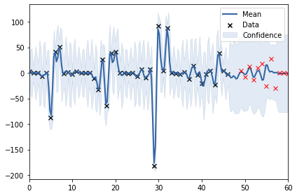

# rainfall-prediction
Predicting rainfall in India using gaussian-process models

Figure: Monthly Rainfall in Jodhpur 1905 predicted using data from 1901-04 (de-trended data) 

Resources: 
- GPs [http://gpss.cc/gpss19/labs](http://gpss.cc/gpss19/labs)
- Locally Periodic Kernel [www.cs.toronto.edu/~duvenaud/cookbook/index.html](www.cs.toronto.edu/~duvenaud/cookbook/index.html)
